# SmartAgroX Application File Flow

## Application Structure Flow

```mermaid
graph TD
    %% Main Entry Points
    App[src/App.tsx] --> Router[React Router]
    
    %% Context Providers
    App --> AuthContext[src/contexts/AuthContext.tsx]
    App --> LangContext[src/contexts/LanguageContext.tsx]
    
    %% Main Layout
    Router --> MainLayout[src/components/layout/MainLayout.tsx]
    MainLayout --> Header[src/components/layout/Header.tsx]
    MainLayout --> Sidebar[src/components/layout/Sidebar.tsx]
    MainLayout --> Footer[src/components/layout/Footer.tsx]
    
    %% Authentication Flow
    Router --> Login[src/pages/Login.tsx]
    Router --> Signup[src/pages/Signup.tsx]
    Login --> AuthContext
    Signup --> AuthContext
    AuthContext --> ProtectedRoute[src/components/auth/ProtectedRoute.tsx]
    
    %% Core Pages
    Router --> Index[src/pages/Index.tsx]
    Router --> Dashboard[src/pages/Dashboard.tsx]
    Router --> Farm[src/pages/Farm.tsx]
    
    %% Feature Pages
    Router --> AgroVision[src/pages/AgroVision.tsx]
    Router --> SoilLab[src/pages/SoilLab.tsx]
    Router --> Weather[src/pages/Weather.tsx]
    Router --> Market[src/pages/Market.tsx]
    Router --> DiseaseScan[src/pages/DiseaseScan.tsx]
    Router --> CropAdvisor[src/pages/CropAdvisor.tsx]
    Router --> AgriBot[src/pages/AgriBot.tsx]
    
    %% Dashboard Components
    Dashboard --> WeatherCard[src/components/dashboard/WeatherForecastCard.tsx]
    Dashboard --> SoilCard[src/components/dashboard/SoilStatusCard.tsx]
    Dashboard --> MarketCard[src/components/dashboard/MarketPriceCard.tsx]
    Dashboard --> DiseaseCard[src/components/dashboard/DiseaseDetectionCard.tsx]
    Dashboard --> CropCard[src/components/dashboard/CropRecommendationCard.tsx]
    Dashboard --> IrrigationCard[src/components/dashboard/IrrigationPlanGuide.tsx]
    Dashboard --> AgribotChat[src/components/dashboard/AgribotChat.tsx]
    
    %% Services Layer
    WeatherCard --> WeatherService[src/services/weatherService.ts]
    AgroVision --> SatelliteService[src/services/satelliteService.ts]
    AgribotChat --> GeminiService[src/services/geminiService.ts]
    
    %% Firebase Integration
    AuthContext --> FirebaseInit[src/components/firebase/FirebaseInit.tsx]
    FirebaseInit --> Firebase[src/lib/firebase.ts]
    Firebase --> Firestore[src/lib/firestore.ts]
    
    %% Custom Hooks
    Dashboard --> UseLocation[src/hooks/useLocation.ts]
    Weather --> UseLocation
    Farm --> UseUserFarms[src/hooks/useUserFarms.ts]
    
    %% AgroVision Components
    AgroVision --> SatMap[src/components/agrovision/SatelliteMap.tsx]
    AgroVision --> NDVIAnalytics[src/components/agrovision/NDVIAnalytics.tsx]
    SatMap --> DrawControl[src/components/agrovision/DrawControl.tsx]
    NDVIAnalytics --> NDVILegend[src/components/agrovision/NDVILegend.tsx]
    
    %% Styling
    classDef entryPoint fill:#93c5fd,stroke:#1d4ed8,stroke-width:2px
    classDef context fill:#fde68a,stroke:#b45309,stroke-width:2px
    classDef page fill:#bbf7d0,stroke:#15803d,stroke-width:2px
    classDef component fill:#e5e7eb,stroke:#4b5563,stroke-width:2px
    classDef service fill:#fecaca,stroke:#991b1b,stroke-width:2px
    
    class App,Router entryPoint
    class AuthContext,LangContext context
    class Index,Dashboard,Farm,AgroVision,SoilLab,Weather,Market,DiseaseScan,CropAdvisor,AgriBot page
    class WeatherCard,SoilCard,MarketCard,DiseaseCard,CropCard,IrrigationCard,AgribotChat,SatMap,NDVIAnalytics component
    class WeatherService,SatelliteService,GeminiService,Firebase,Firestore service

```

## File Dependencies Explanation

### Entry Points
- `src/App.tsx`: Main application entry point
- React Router: Handles routing between different pages

### Context Providers
- `src/contexts/AuthContext.tsx`: Manages authentication state
- `src/contexts/LanguageContext.tsx`: Handles internationalization

### Layout Components
- `src/components/layout/MainLayout.tsx`: Main application layout wrapper
- `src/components/layout/Header.tsx`: Top navigation bar
- `src/components/layout/Sidebar.tsx`: Side navigation menu
- `src/components/layout/Footer.tsx`: Footer component

### Authentication
- `src/pages/Login.tsx`: Login page
- `src/pages/Signup.tsx`: Registration page
- `src/components/auth/ProtectedRoute.tsx`: Route protection wrapper

### Core Pages
- `src/pages/Index.tsx`: Landing page
- `src/pages/Dashboard.tsx`: Main dashboard
- `src/pages/Farm.tsx`: Farm management

### Feature Pages
- `src/pages/AgroVision.tsx`: Satellite monitoring
- `src/pages/SoilLab.tsx`: Soil analysis
- `src/pages/Weather.tsx`: Weather forecasting
- `src/pages/Market.tsx`: Market prices
- `src/pages/DiseaseScan.tsx`: Disease detection
- `src/pages/CropAdvisor.tsx`: Crop recommendations
- `src/pages/AgriBot.tsx`: AI assistant

### Dashboard Components
- `src/components/dashboard/*.tsx`: Various dashboard cards and widgets

### Services
- `src/services/weatherService.ts`: Weather API integration
- `src/services/satelliteService.ts`: Satellite data processing
- `src/services/geminiService.ts`: AI chat integration
- `src/lib/firebase.ts`: Firebase configuration
- `src/lib/firestore.ts`: Database operations

### Custom Hooks
- `src/hooks/useLocation.ts`: Location management
- `src/hooks/useUserFarms.ts`: Farm data management

### AgroVision Components
- `src/components/agrovision/*.tsx`: Satellite monitoring components

## Color Legend
- 🔵 Blue: Entry points and core routing
- 🟡 Yellow: Context providers
- 🟢 Green: Pages
- ⚪ Gray: Components
- 🔴 Red: Services and external integrations

This flow diagram shows how different files in the application are connected and depend on each other, making it easier to understand the codebase structure and relationships between different parts of the application.
