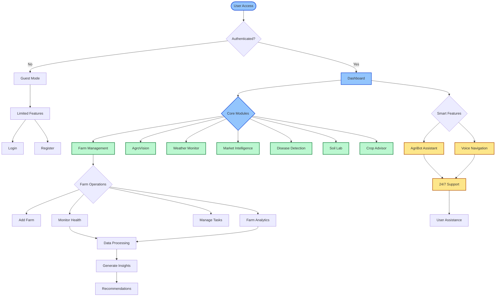

# SmartAgroX User Guide

## Application Flowchart

## Overview
SmartAgroX is a comprehensive agricultural management platform that combines modern technology with farming practices to help farmers make informed decisions and optimize their agricultural operations.

## Key Features

### 1. Authentication & User Management
- Secure user authentication system
- Personal profile management
- Protected routes for authenticated users
- Multi-language support (English, Telugu, Hindi)

### 2. Dashboard
The central hub of the application with:
- Weather forecasts
- Soil status monitoring
- Crop recommendations
- Disease detection alerts
- Market price updates
- Irrigation planning
- Task management
- Farm analytics

### 3. Core Modules

#### Farm Management
- Add and manage multiple farms
- Track farm status and health
- Soil analysis
- Crop monitoring
- Task scheduling
- Farm analytics

#### AgroVision
- Satellite-based crop monitoring
- NDVI (Normalized Difference Vegetation Index) analytics
- Real-time farm visualization
- Historical crop health data

#### Weather Monitoring
- Real-time weather updates
- Agricultural forecasts
- Weather-based farming recommendations
- Location-specific weather data

#### Market Intelligence
- Real-time market prices
- Price trends and analysis
- Commodity rates
- Market predictions

#### Disease Detection
- Plant disease scanning
- Early warning system
- Treatment recommendations
- Disease history tracking

#### Soil Laboratory
- Soil health analysis
- pH level monitoring
- Organic matter tracking
- Fertility assessment
- Recommendations for improvement

#### Crop Advisor
- Personalized crop recommendations
- Season-based planning
- Crop rotation suggestions
- Yield optimization tips

### 4. Smart Features

#### AgriBot Chat Assistant
- 24/7 farming assistance
- Personalized recommendations
- Multi-language support
- Context-aware responses
- Integration with farm data

#### Voice Navigation
- Voice-controlled interface
- Multi-language voice commands
- Hands-free operation
- Voice-based information retrieval

## Application Flow

1. **User Entry**
   - New users can sign up
   - Existing users can log in
   - Demo mode available for exploring features

2. **Initial Setup**
   - Profile creation
   - Farm registration
   - Location settings
   - Language preferences

3. **Daily Operations**
   - Dashboard overview
   - Weather check
   - Task management
   - Farm monitoring
   - Market price updates

4. **Farm Management**
   - Add/edit farm details
   - Monitor farm health
   - Schedule tasks
   - Track progress
   - Analyze farm data

5. **Analysis & Planning**
   - Soil testing
   - Disease scanning
   - Crop planning
   - Market analysis
   - Weather-based decisions

6. **Support & Assistance**
   - AgriBot chat help
   - Voice assistance
   - Multi-language support
   - Context-aware help

## System Requirements

### Web Application
- Modern web browser (Chrome, Firefox, Safari, Edge)
- Internet connection
- GPS enabled for location features
- Camera access for disease scanning
- Microphone access for voice features

### Mobile Access
- Responsive design for mobile devices
- Touch-friendly interface
- Progressive Web App capabilities

## Data Privacy & Security
- Secure authentication
- Encrypted data transmission
- Protected farm data
- User privacy controls
- Secure cloud storage

## Support & Feedback
- In-app help through AgriBot
- Multi-language support
- Voice-assisted help
- Regular updates and improvements

---

*Note: This application is designed to assist farmers in making informed decisions. Always verify critical farming decisions with local agricultural experts when necessary.*
