# SmartAgroX Architecture Diagram

```mermaid
graph TD
    %% Main Application Structure
    Client[Client Browser] --> App[App.tsx]
    App --> Router[React Router]
    
    %% Core Layers
    Router --> Pages[Pages Layer]
    Pages --> Components[Components Layer]
    Components --> Hooks[Custom Hooks]
    Components --> Services[Services Layer]
    
    %% State Management
    App --> Contexts[Context Providers]
    Contexts --> AuthContext[Authentication Context]
    Contexts --> LanguageContext[Language Context]
    
    %% External Services
    Services --> FirebaseService[Firebase Services]
    FirebaseService --> FirebaseAuth[Authentication]
    FirebaseService --> Firestore[Firestore Database]
    FirebaseService --> Storage[Cloud Storage]
    
    Services --> GeminiService[Google Gemini AI]
    Services --> WeatherService[Weather API]
    
    %% UI Components Structure
    Components --> LayoutComponents[Layout Components]
    LayoutComponents --> MainLayout[Main Layout]
    LayoutComponents --> Sidebar[Sidebar]
    LayoutComponents --> Header[Header]
    LayoutComponents --> Footer[Footer]
    
    Components --> UIComponents[UI Components]
    UIComponents --> ShadcnUI[Shadcn UI Library]
    
    Components --> CustomComponents[Custom Components]
    CustomComponents --> DiseaseDetection[Disease Detection]
    CustomComponents --> SoilAnalysis[Soil Analysis]
    CustomComponents --> PestAnalysis[Pest Analysis]
    CustomComponents --> CropRecommendation[Crop Recommendation]
    
    %% Pages Structure
    Pages --> HomePage[Home Page]
    Pages --> DashboardPage[Dashboard]
    Pages --> DiseaseScanPage[Disease Scan]
    Pages --> SoilLabPage[Soil Lab]
    Pages --> CropAdvisorPage[Crop Advisor]
    Pages --> WeatherPage[Weather]
    Pages --> MarketPage[Market]
    Pages --> AgribotPage[Agribot]
    
    %% Internationalization
    App --> I18n[i18n Translation]
    I18n --> EN[English]
    I18n --> TE[Telugu]
    I18n --> HI[Hindi]
    
    %% Styling
    App --> Styling[Styling]
    Styling --> Tailwind[Tailwind CSS]
    Styling --> CustomCSS[Custom CSS]
    Styling --> FramerMotion[Framer Motion]
    
    %% Data Flow
    subgraph DataFlow [Data Flow]
        API[API Requests] --> DataProcessing[Data Processing]
        DataProcessing --> StateManagement[State Management]
        StateManagement --> UIRendering[UI Rendering]
    end
    
    %% Legend
    classDef core fill:#d4f1f9,stroke:#05728f,stroke-width:2px
    classDef service fill:#ffe6cc,stroke:#d79b00,stroke-width:2px
    classDef ui fill:#d5e8d4,stroke:#82b366,stroke-width:2px
    classDef page fill:#e1d5e7,stroke:#9673a6,stroke-width:2px
    classDef external fill:#f8cecc,stroke:#b85450,stroke-width:2px
    
    class App,Router,Pages,Components,Hooks,Services,Contexts core
    class FirebaseService,GeminiService,WeatherService service
    class LayoutComponents,UIComponents,CustomComponents,ShadcnUI ui
    class HomePage,DashboardPage,DiseaseScanPage,SoilLabPage,CropAdvisorPage,WeatherPage,MarketPage,AgribotPage page
    class FirebaseAuth,Firestore,Storage,I18n external
```

## Architecture Overview

### Frontend Framework
- **React**: Core UI library
- **TypeScript**: Type-safe JavaScript
- **Vite**: Fast build tool and development server

### UI Components
- **Shadcn UI**: Component library based on Radix UI
- **Tailwind CSS**: Utility-first CSS framework
- **Framer Motion**: Animation library for interactive UI elements

### Routing
- **React Router**: Client-side routing

### State Management
- **React Context API**: Global state management
- **Custom Hooks**: Reusable stateful logic

### External Services
- **Firebase**:
  - Authentication
  - Firestore Database
  - Cloud Storage
- **Google Gemini AI**: AI-powered crop and disease analysis
- **Weather API**: Weather data and forecasts

### Internationalization
- **i18next**: Translation framework
- **Supported Languages**: English, Telugu, Hindi

### Key Features
1. **Disease Detection**: AI-powered plant disease identification
2. **Soil Analysis**: Soil type and fertility assessment
3. **Pest Analysis**: Pest identification and management
4. **Crop Recommendations**: AI-driven crop suggestions
5. **Weather Forecasting**: Location-based weather information
6. **Market Prices**: Agricultural commodity pricing
7. **Farm Monitoring**: Comprehensive farm health tracking

### Data Flow
1. User interacts with the UI
2. React components trigger API calls to external services
3. Data is processed and stored in state (Context API)
4. UI re-renders with updated data
5. Changes are persisted to Firebase when needed

### Deployment
- Vite-optimized build process
- Static site hosting
